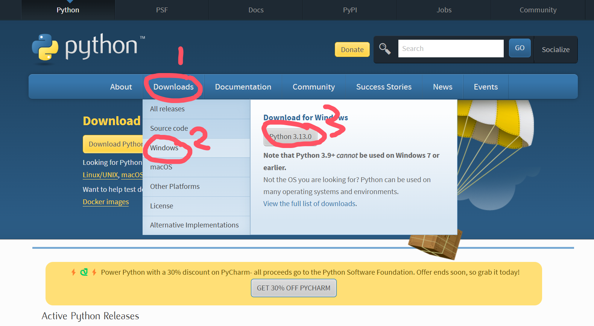

# ADAM_cliparoo

## 1.介绍
本项目是一个基于 Python 的视频处理工具，用于批量处理获取创想三维耗材赞助所需发布的视频文件。功能包括：
- 遍历 `video` 文件夹中的所有子文件夹。
- 将每个子文件夹中的多个视频拼接成一个视频。
- 为每个视频添加左上角的 logo 水印。
- 在视频的第 50 帧到第 200 帧添加底部居中的文字水印。
- 从 `music` 文件夹中随机选择背景音乐合并到视频中。
- 处理后的结果视频保存在 `result` 文件夹中，并按顺序命名（如 `1.mp4`、`2.mp4`）。

## 2.目录结构
确保项目文件夹具有以下结构：
```bash
project_folder/
├── run.bat                  # Windows 批处理文件，用于快速启动程序
├── main.py                  # 主 Python 脚本，处理视频和音频
├── requirements.txt         # 项目依赖列表
├── config.json              # 配置文件，用户可自定义设置
├── logo.png                 # 用于添加到视频的 logo 图片
├── video                    # 存放待处理视频的文件夹
│   ├── dir1
│   │   ├── video1.mp4
│   │   ├── video2.mp4
│   ├── dir2
│       ├── video3.mp4
│       └── video4.mp4
├── music                    # 存放背景音乐文件的文件夹
│   ├── background1.ogg
│   ├── background2.ogg
└── result                   # 存放处理后视频的文件夹
```

## 3.安装与使用

**环境准备**

确保你的机器上安装了 Python 3.7 及以上版本：

下载后安装，请勾选addtopath

**快速开始**

你可以通过双击 run.bat 文件来检查或创建虚拟环境和自动执行程序。


### 4.配置
你可以通过编辑 config.json 文件来自定义以下参数：

```json
复制代码
{
    "logo_path": "logo.png",               // logo 图片路径
    "text": "创想三维3D打印",                // 视频水印文字
    "text_frame_start": 50,                 // 水印文字开始显示的帧数
    "text_frame_end": 200,                  // 水印文字结束显示的帧数
    "text_color": [255, 255, 255],          // 水印文字颜色 (RGB)
    "text_font_size": 1,                    // 水印文字字体大小
    "text_thickness": 2                    // 水印文字厚度
}
```
如需更换视频中的背景音乐，请直接更改 music 文件夹中的音乐文件。

如果需要更改视频中的 logo 或水印文字，请更新 logo.png 和 config.json 文件。
